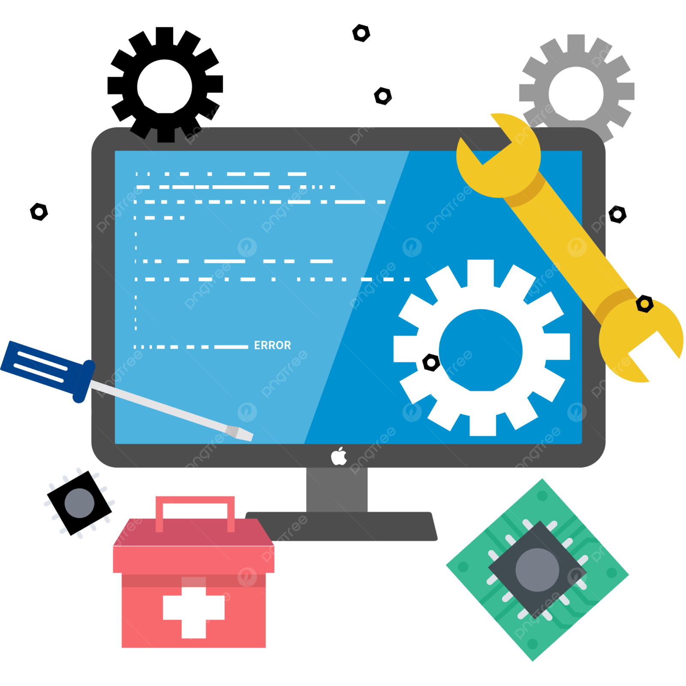

#  Proyecto Intermodular 1º DAW 2024/2025  

## Servicio de Reparaciones Informáticas
## 📑 Índice
1. [Descripción General](#descripción-general)
2. [Objetivos del Proyecto](#objetivos-del-proyecto)
3. [Equipo](#equipo)
4. [Subsistemas del Proyecto](#subsistemas-del-proyecto)
   - [Gestión de Materiales](#1-gestión-de-materiales)
   - [Gestión de Personal](#2-gestión-de-personal)
   - [Gestión de Reparaciones](#3-gestión-de-reparaciones)
   - [Gestión de Clientes](#4-gestión-de-clientes)
   - [Generación de Informes](#5-generación-de-informes)
5. [Requisitos del Sistema](#requisitos-del-sistema)
6. [Requisitos del Proyecto](#requisitos-del-proyecto)
